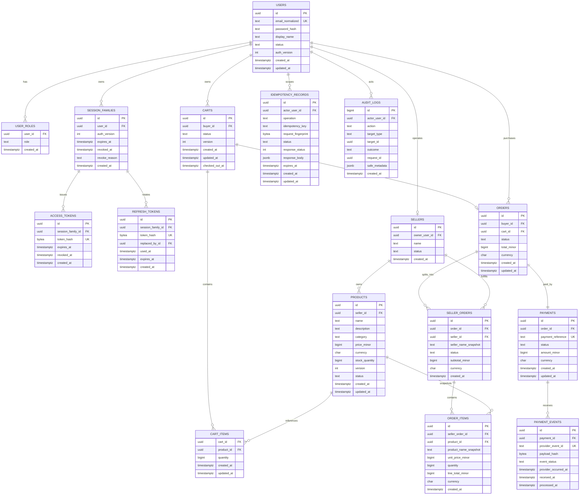

# Entity Relationship Diagram

Status: **Implemented** by `migrations/001_initial.sql`; this diagram is the
review-oriented view of the executable PostgreSQL schema.

## Required constraints not fully expressible in the diagram

- Partial unique index: one `active` cart per buyer.
- Unique `(cart_id, product_id)` for cart items.
- Unique `orders.cart_id`.
- Unique `(order_id, seller_id)` for seller orders.
- Unique `(actor_user_id, operation, idempotency_key)`.
- Unique `(user_id, role)`.
- Checks: price and stock are non-negative; quantities are positive; supported
  currency is `IDR`; totals are non-negative.
- Foreign key `refresh_tokens.replaced_by_id` references another refresh token and
  cannot point to itself.

The migration implements indexes derived from the catalog, ownership, session,
checkout, payment-event, idempotency, and audit query shapes.
